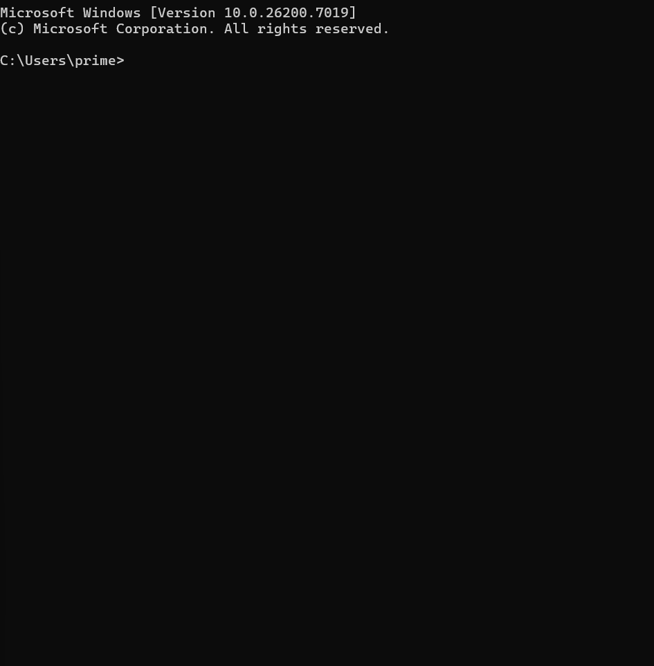

# README_Generator

## 🚀 キャプチャ / デモ



## 概要

Haskellの講義の総括として自主作成した、対話型のREADME.mdジェネレータです。  
READMEに必要な項目（概要、使用技術、機能一覧など）をターミナルで対話的に質問し、入力内容に基づいて構造化された`README.md`ファイルを自動生成します。  
Haskellの基本的なIO操作 (`System.IO`)、`do`記法、そしてIOアクションと純粋なロジック (`buildMarkdown`関数) の分離を意識して設計しました。

## 🛠️ 使用技術

**Haskell** (GHC)
-   `System.IO` (ファイル入出力、エンコーディング設定)
-   `Data.List` (文字列結合)

## ✨ 機能一覧

* 対話型インターフェースによるREADME項目の入力
* 複数行入力のサポート (概要、機能一覧など)
* 入力内容に基づいたMarkdownファイルの動的生成
* 条件分岐によるセクションの表示/非表示 (画像、デモURL、環境変数)
* UTF-8エンコーディングによる安全なファイル書き出し

## 📦 インストール / セットアップ

GHC (Glasgow Haskell Compiler) がインストールされている必要があります。
```bash
# コンパイル
ghc README_Generator.hs
# 実行
./README_Generator
```

## 📜 ライセンス

This project is licensed under the MIT License.

## 💡 工夫した点 / 苦労した点

### 1. Haskellの学習成果を即実践へ
このツールの開発は、Haskellの講義で得た知識を、机上の学習で終わらせないために挑戦したものです。学んだばかりのHaskellの知識を即座に実践で活かしたいと考え、自らHaskellでの開発を選択しました。
### 2. Haskellの設計思想「副作用と純粋関数」の体現
この開発を通じて、Haskellの重要な設計思想である**副作用（IO）と純粋なロジックの分離**を実践的に学びました。
-   **副作用の分離 (`main :: IO ()`)** ユーザーとの対話（`putStrLn`, `getLine`）やファイルシステムへの書き込み（`openFile`, `hPutStr`）など、外部の状態を変更しうる「副作用」を伴う処理は、すべて`main`関数（IOモナド）内に集約しました。
-   **純粋なロジック (`buildMarkdown`)** 一方で、入力された文字列をMarkdown形式に組み立てるコアロジックは、IOを一切含まない**純粋関数**（`buildMarkdown :: String -> ... -> String`）として明確に分離しました。

この設計により、ロジック部分（`buildMarkdown`）は予測可能でテストしやすく、副作用部分（`main`）は一箇所にまとまるため、コード全体の保守性と見通しが大幅に向上することを体感できました。
